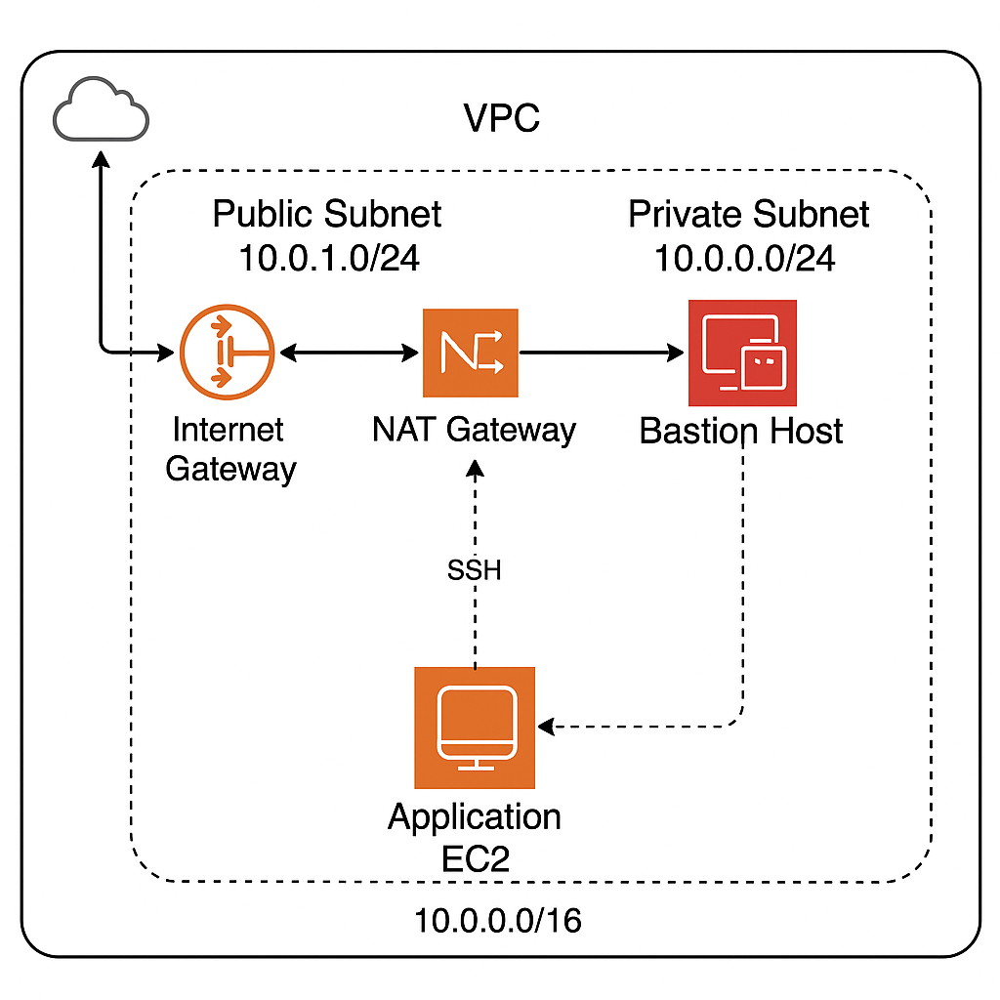

## AWS Virtual Private Cloud Lab

Engineered segmented VPC networking with public/private subnets, NAT, and bastion host for secure, isolated AWS infrastructure.

---

## Table of Contents

- [Overview]
- [Objectives]
- [Steps Performed]
  - [1. Terraform Initialization and Deployment]
  - [2. VPC and Subnet Configuration]
  - [3. Internet Gateway & NAT Gateway]
  - [4. Route Tables]
  - [5. EC2 Deployment and Security]
  - [6. Connectivity Testing]
- [Screenshots]
- [Lessons Learned]
- [References]

---

## Overview

This project demonstrates the process of designing and deploying a secure Virtual Private Cloud (VPC) in AWS using Terraform. The lab focuses on network segmentation, least-privilege access, and secure connectivity through public/private subnets, a NAT gateway, and a bastion host.

---

## Diagram

---

## Objectives

- Create a custom VPC with public and private subnets.
- Deploy a bastion host for secure SSH access.
- Deploy an application EC2 instance in a private subnet (no public IP).
- Configure a NAT gateway to provide outbound internet for private resources.
- Apply security groups and route tables to enforce network isolation and least-privilege principles.
- Document all resources and security controls with clear evidence.

---

## Steps Performed

1. Terraform Initialization and Deployment
   - Ran terraform init and terraform apply to automate infrastructure provisioning.

2. VPC and Subnet Configuration
   - Created a VPC (10.0.0.0/16) with one public and one private subnet.
   - Ensured subnets were in the correct availability zone.

3. Internet Gateway & NAT Gateway
   - Attached an Internet Gateway (IGW) to the VPC.
   - Provisioned a NAT Gateway with an Elastic IP for outbound traffic from the private subnet.

4. Route Tables
   - Configured public route table to route 0.0.0.0/0 through IGW; associated with public subnet.
   - Configured private route table to route 0.0.0.0/0 through NAT Gateway; associated with private subnet.

5. EC2 Deployment and Security
   - Launched a bastion host in the public subnet (with public IP for SSH).
   - Launched a private EC2 instance in the private subnet (no public IP).
   - Security groups to restrict SSH: bastion only accessible from my IP, private EC2 only from bastion.

6. Connectivity Testing
   - Successfully SSH’d into the bastion host, then into the private EC2 from the bastion.

---

## Screenshots

*All relevant screenshots demonstrating each step are included in the screenshots/ folder of this repository.

| Order | File Name                                 | What it Shows                                          |
| ----- | ----------------------------------------- | ------------------------------------------------------ |
| 1     | terraforminit-success.png                 | Successful initialization of Terraform project         |
| 2     | terraformapply-success.png                | Terraform apply run with resources created             |
| 3     | vpc-success.png                           | Custom VPC created with correct CIDR                   |
| 4     | subnets-public-success.png                | Public subnet created and configured                   |
| 5     | subnets-private-success.png               | Private subnet created and configured                  |
| 6     | igw-success.png                           | Internet Gateway attached to VPC                       |
| 7     | natgateway-success.png                    | NAT Gateway provisioned and available                  |
| 8     | ec2-elasticip-success.png                 | Elastic IP assigned for NAT Gateway                    |
| 9     | publicroutetable-success.png              | Public route table with IGW route                      |
| 10    | publicroutetable-association-success.png  | Public subnet associated with public route table       |
| 11    | privateroutetable-success.png             | Private route table with NAT Gateway route             |
| 12    | privateroutetable-association-success.png | Private subnet associated with private route table     |
| 13    | 3c2-instances-success.png                 | Bastion and private EC2 instances deployed and running |
| 14    | ssh-bastion-connection.png                | SSH connection established to bastion host             |
| 15    | ssh-bastion-to-private-ec2.png            | SSH connection from bastion to private EC2 instance    |

## Screenshot Explanations

1. terraforminit-success.png: Initialized Terraform project to prepare for infrastructure deployment.

2. terraformapply-success.png: Ran terraform apply and confirmed successful provisioning of all AWS resources.

3. vpc-success.png: Verified the custom VPC is present with the correct CIDR block.

4 - 5. subnets-public-success.png & subnets-private-success.png: Confirmed public and private subnets were created and configured properly.

6. igw-success.png: Internet Gateway is attached to the VPC, allowing outbound Internet from the public subnet.

7. natgateway-success.png: NAT Gateway created in public subnet for private subnet outbound Internet access.

8. ec2-elasticip-success.png: Elastic IP address allocated and associated with the NAT Gateway.

9 & 10. publicroutetable-success.png - publicroutetable-association-success.png: Public route table set to send 0.0.0.0/0 traffic through IGW; associated with public subnet.

11 & 12. privateroutetable-success.png - privateroutetable-association-success.png: Private route table set to send 0.0.0.0/0 traffic through NAT Gateway; associated with private subnet.

13. 3c2-instances-success.png: Both bastion and private EC2 instances are running in their respective subnets.

14. ssh-bastion-connection.png: Successfully connected via SSH to the bastion host (public subnet).

15. ssh-bastion-to-private-ec2.png: SSH hop from bastion host to private EC2 instance (proving network isolation and bastion use).

---

## References

- AWS VPC Documentation
https://docs.aws.amazon.com/vpc/latest/userguide/what-is-amazon-vpc.html

- Terraform AWS Provider Docs
https://registry.terraform.io/providers/hashicorp/aws/latest/docs

- AWS Security Best Practices
https://docs.aws.amazon.com/securityhub/latest/userguide/securityhub-standards-fsbp.html

---

Sebastian Silva C. - July, 2025 - Berlin, Germany.
